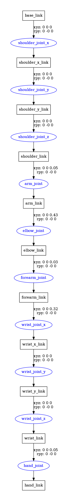

# Домашнее задание 2 — ROS2 + URDF

## Задание
1. Создать ROS-пакет.  
2. Создать собственный URDF-файл (робот должен содержать не менее **3 звеньев (links)** и **3 шарниров (joints)**).  
3. Визуализировать модель робота в **RViz** (через launch-файл, добавив `joint_state_publisher` и `robot_state_publisher`).  
4. Написать код Python/C++ для управления положением робота.  
5. Добавить **launch-файл** для запуска визуализации и движения.  
6. Подготовить **видео с запуском визуализации и движением робота**.  
7. Построить визуализацию **URDF Tree**.  
8. Сделать **отчёт (Word/PDF/README)**: описание робота, структура робота, описание движения.  
---

## Структура проекта
```

ros_ws/
├── build/
├── install/
├── log/
├── Makefile                # команды build/run/clean
├── scripts/
└── src/
└── anthropomorphic_hand/
├── CMakeLists.txt
├── package.xml
├── launch/
│   └── display.launch.py
├── rviz/
│   └── arm.rviz
├── scripts/
│   └── arm_wave.py
└── urdf/
└── anthropomorphic_arm.urdf

````

---

## URDF-модель
Файл: [`src/anthropomorphic_hand/urdf/anthropomorphic_arm.urdf`](src/anthropomorphic_hand/urdf/anthropomorphic_arm.urdf)  

Робот — **антропоморфная рука**:  
- плечо (3 DOF),  
- плечевая кость (фиксированная),  
- локоть (1 DOF),  
- предплечье (фиксированная),  
- запястье (3 DOF),  
- кисть (фиксированная).  

Итого: **7 степеней свободы**.  

---

## Управление движением
Файл: [`src/anthropomorphic_hand/scripts/arm_wave.py`](src/anthropomorphic_hand/scripts/arm_wave.py)  

Реализован класс `ArmAnimator`, который публикует в топик `/joint_states` последовательность движений:  
- подъём руки,  
- махи запястьем (жест «привет»),  
- опускание руки.  

Движения плавные, рассчитаны с помощью синусоидальных функций.

---

## Launch-файл
Файл: [`src/anthropomorphic_hand/launch/display.launch.py`](src/anthropomorphic_hand/launch/display.launch.py)  

Запускает:  
- `robot_state_publisher` с URDF-моделью,  
- `rviz2` с конфигом `arm.rviz`,  
- ноду `arm_wave.py` для анимации.  

> Также содержит запуску ноду ручного управления `joint_state_publisher_gui`, но она закомментирована, чтобы не мешать автоматическому

Запуск:
```bash
ros2 launch anthropomorphic_hand display.launch.py
````

---

## Сборка и запуск

### Сборка

```bash
make build
```

### Запуск

```bash
make run
```

### Очистка

```bash
make clean
```

---

## Визуализация URDF Tree

Результат команды `check_urdf src/anthropomorphic_hand/urdf/anthropomorphic_arm.urdf`:

```
robot name is: anthropomorphic_arm
---------- Successfully Parsed XML ---------------
root Link: base_link has 1 child(ren)
    child(1):  shoulder_x_link
        child(1):  shoulder_y_link
            child(1):  shoulder_link
                child(1):  arm_link
                    child(1):  elbow_link
                        child(1):  forearm_link
                            child(1):  wrist_x_link
                                child(1):  wrist_y_link
                                    child(1):  wrist_link
                                        child(1):  hand_link
```

Результат команды `urdf_to_graphiz src/anthropomorphic_hand/urdf/anthropomorphic_arm.urdf`:



---

## Видео

Видеозапись демонстрации запуска RViz и движения руки приложена:

👉 [Смотреть видео демонстрации](docs/demo.mp4)

(При загрузке на GitHub — файл `demo.mp4` можно воспроизвести прямо в браузере).

---
